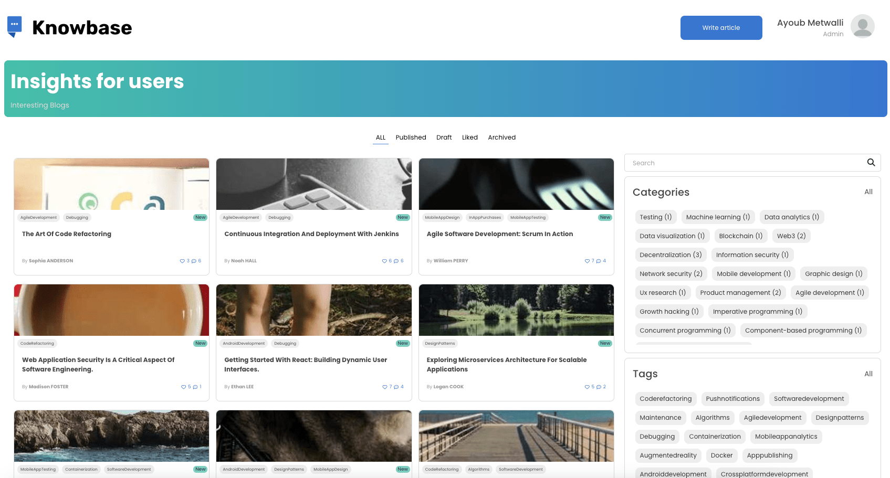
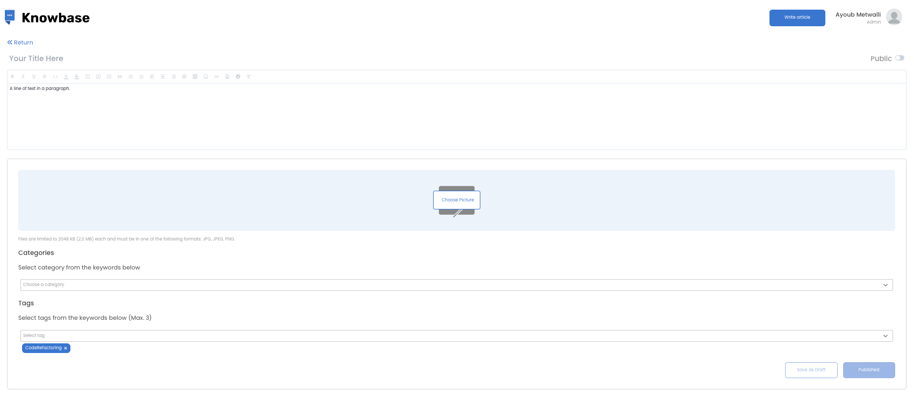
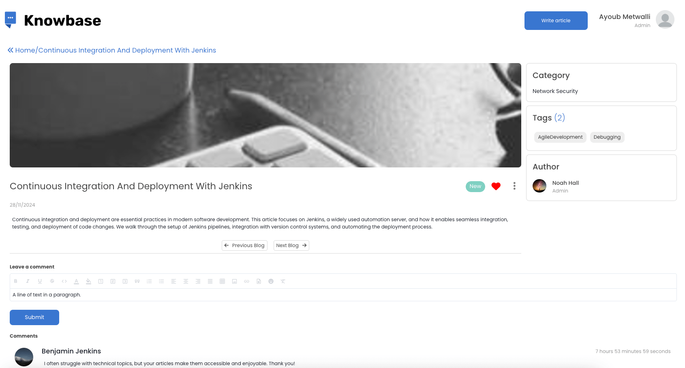

# KnowBase Application

This demo app is built with 4D Qodly Pro and is meant to inspire you or help you kickstart your own project.

## 🎯 Purpose of the Application

This application serves as a complete blogging platform allowing users to create, read, interact with, and manage blog posts. It includes role-based access, user interaction features (likes and comments), and automated notifications to authors.

## 🏠 Main Features

- Interactive Datatable to browse blog posts
- Dedicated blog post pages (full content view)

- CRUD workflows for writing, editing, and publishing posts

- Ability to read, write, like, and comment on blog posts

- Automatic email notifications sent to the blog owner when their post receives a like or comment

- Built-in notification settings allowing each user to enable/disable alerts

- Public users can read blogs

- Secure role-based access management

## 🚀 How to run

###  Pre-requisites (4D Software):
- Download the latest Release version of 4D: [Product Download](https://us.4d.com/product-download/Feature-Release)
- Or the latest Beta version: [Beta Program](https://discuss.4d.com/)
- Follow activation steps: [Installation Guide](https://developer.4d.com/docs/GettingStarted/installation)

### Steps to Run the Project
- Clone or download this repository to your local machine. Need help? See Using GitHub with 4D.
- Open the project in 4D: Go to File > Open Project (More details here: Open a Project)
- Open Qodly Studio: Go to Design > Qodly Studio menu
- Run the application: Click Run to start the server and preview the app in your browser

## Configuration & Credentials
 
This section explains exactly how to wire credentials and test the app (what to create, where to place files, and what the app already provides).

### Do I need to create external accounts?
  - Mailing: Yes — if you want emails to be sent (approvals, notifications) you should create an SMTP-capable account (or SMTP-compatible API service such as SendGrid SMTP).
    - Example (SendGrid SMTP):
      - Host: `smtp.sendgrid.net`
      - Port: `587` (or 465 for SSL)
      - User: `apikey` (SendGrid uses `apikey` as username)
      - Password: `<your SendGrid API key>`

### Where does the app read credentials?
- Credentials are configured via the **Settings** page inside the application.
- External service keys and secrets are stored and accessed through the database.

### How to test email sending locally
Provide SendGrid/SMTP credentials as above, then trigger an action that sends mail (e.g., blog like that calls `Mailer.4dm:send`).
 
## Test accounts and sample data

  - The app includes a data generator `Project/Sources/Merhods/initDB.4dm` which creates sample users with known emails and passwords. You can call it from the UI (index.WebForm) or run `ds.generateData()` in the server console.

## Where to find the code for each feature

If you want to change the behavior or appearance of a specific feature, edit the files listed below.
 
- Authentication / Login
  - UI: `Project/Sources/WebForms/login.WebForm`.
  - Server: `Project/Sources/Classes/DataStore.4dm` (method: `authentify`) — handles login, session privileges and landing page routing.

- Dashboard (balances)
  - UI: `Project/Sources/WebForms/userEngagment.WebForm`.
  - Server: `Project/Sources/Classes/User.4dm` (`userPieChart` : Active vs inactive users distribution for dashboard pie chart. `topUsers` : Top 20 users ranked by engagement (articles or comments, depending on role)).

   - UI: `Project/Sources/WebForms/ArticlePerformance.WebForm`.
  - Server: `Project/Sources/Classes/Article.4dm` (`articlePieChart()`: Distribution of published vs draft articles for dashboard pie chart. `articleMostLikes()`: Top 10 articles ranked by number of likes.)

